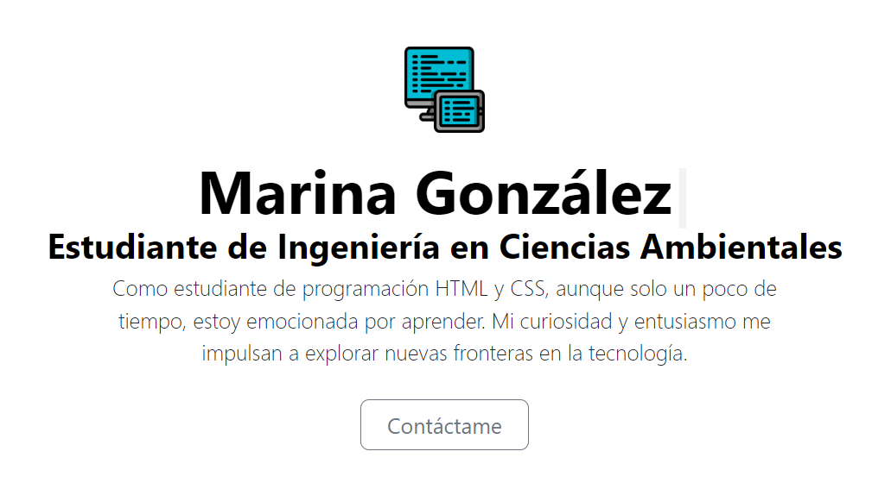
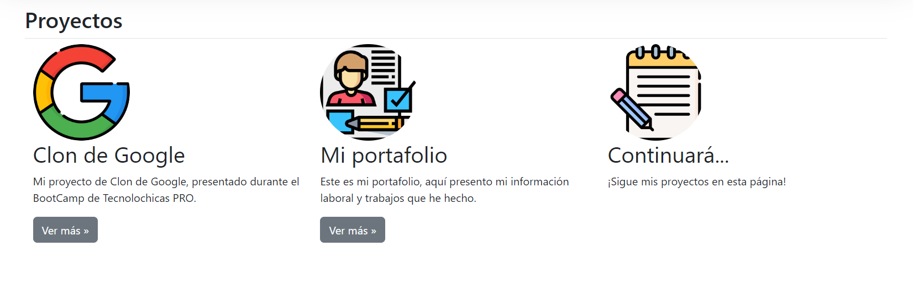
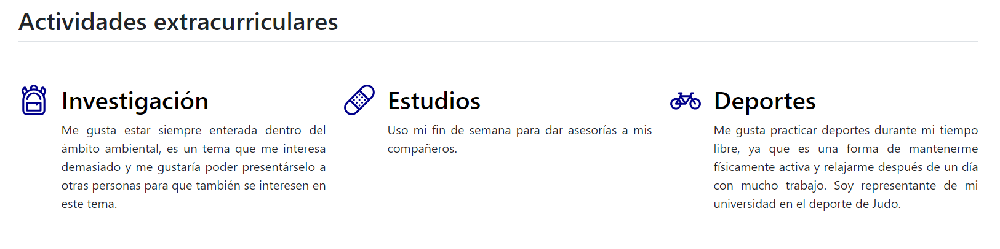
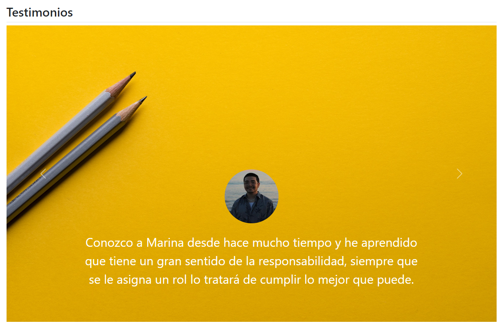

## Portafolio personal: Techonolochicas PRO

Este proyecto fue creado durante el bootacamp Technolochicas PRO, es una página web responsiva (adptable a diversos dispositivos).

El propósito de la creación de este sitio web es mostrar el portafolio de proyectos de la desarrolladora y la experiencia alrededor del área.

<a href="https://sage-biscuit-2ea8cd.netlify.app/" target="_blank">**Visitalo ahora** 🚀</a>

# Secciones
Sobre mí:

Mis proyectos:

Actividades:

Testimonios:

# Tecnologías

## 📬 Contacto

Si estás interesad@ en compartir o conectar para algún proyecto u oportunidad laboral, contáctame.

<a href="https://www.linkedin.com/in/marina-gonzalez-p17/"></img></a>

© 2023 Marina (Programa Technolochicas PRO)

